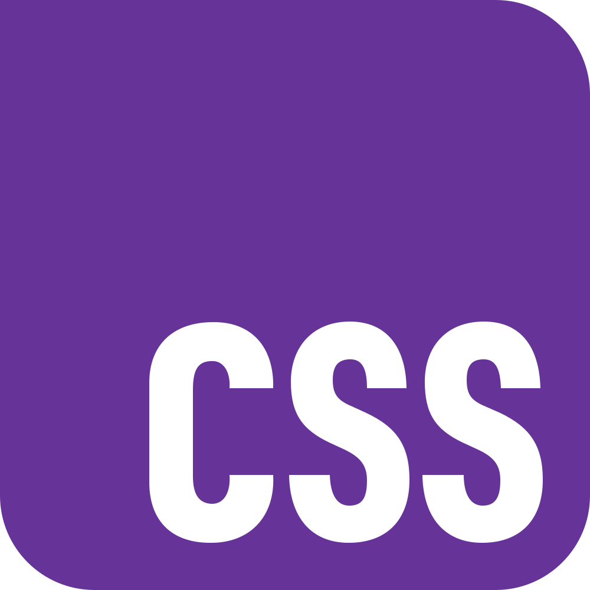

  
  

<h1 align="center">
  Hey, I'm Lucas Bracamonte
  
</h1>

  

---

### GitHub Trophies :

---

### ⚡ Languages:

  <table>
    <tr>
      <td align="center" width="88">
        
         HTML5
      </td>
      <td align="center" width="88">
        
         CSS3
      </td>
      <td align="center" width="88">
        
         JavaScript
      </td>
      <td align="center" width="88">
        
         TypeScript
      </td>
      <td align="center" width="88">
        
         Python
      </td>
      <td align="center" width="88">
        
         React.js
      </td>
      <td align="center" width="88">
        
         Next.js
      </td>
      <td align="center" width="88">
        
         Node.js
      </td>
      <td align="center" width="88">
        
         .NET
      </td>
    </tr>
    <tr>
      <td align="center" width="88">
        
         Sass
      </td>
      <td align="center" width="88">
        
         Tailwind
      </td>
      <td align="center" width="88">
        
         Boostrup
      </td>
      <td align="center" width="88">
        
         Html5
      </td>
      
    </tr>
  </table>

---

### 🤖 AI / ML:

  <table>
    <tr>
      <td align="center" width="88">
        
         HTML5
      </td>
      <td align="center" width="88">
        
         CSS3
      </td>
      <td align="center" width="88">
        
         JavaScript
      </td>
      <td align="center" width="88">
        
         TypeScript
      </td>
      <td align="center" width="88">
        
         Python
      </td>
      <td align="center" width="88">
        
         React.js
      </td>
      <td align="center" width="88">
        
         Next.js
      </td>
      <td align="center" width="88">
        
         Node.js
      </td>
      <td align="center" width="88">
        
         .NET
      </td>
    </tr>
    <tr>
      <td align="center" width="88">
        
         Sass
      </td>
      <td align="center" width="88">
        
         Tailwind
      </td>
      <td align="center" width="88">
        
         MongoDB
      </td>
      <td align="center" width="88">
        
         PostgreSQL
      </td>
      <td align="center" width="88">
        
         Drizzle
      </td>
      <td align="center" width="88">
        
         Redis
      </td>
      <td align="center" width="88">
        
         Docker
      </td>
      <td align="center" width="88">
        
         Kubernetes
      </td>
      <td align="center" width="88">
        
         AWS
      </td>
    </tr>
  </table>

---

### Database:

  <table>
    <tr>
      <td align="center" width="88">
        
         HTML5
      </td>
      <td align="center" width="88">
        
         CSS3
      </td>
      <td align="center" width="88">
        
         JavaScript
      </td>
      <td align="center" width="88">
        
         TypeScript
      </td>
      <td align="center" width="88">
        
         Python
      </td>
      <td align="center" width="88">
        
         React.js
      </td>
      <td align="center" width="88">
        
         Next.js
      </td>
      <td align="center" width="88">
        
         Node.js
      </td>
      <td align="center" width="88">
        
         .NET
      </td>
    </tr>
    <tr>
      <td align="center" width="88">
        
         Sass
      </td>
      <td align="center" width="88">
        
         Tailwind
      </td>
      <td align="center" width="88">
        
         MongoDB
      </td>
      <td align="center" width="88">
        
         PostgreSQL
      </td>
      <td align="center" width="88">
        
         Drizzle
      </td>
      <td align="center" width="88">
        
         Redis
      </td>
      <td align="center" width="88">
        
         Docker
      </td>
      <td align="center" width="88">
        
         Kubernetes
      </td>
      <td align="center" width="88">
        
         AWS
      </td>
    </tr>
  </table>

---

### Operating system:

  <table>
    <tr>
      <td align="center" width="88">
        
         HTML5
      </td>
      <td align="center" width="88">
        
         CSS3
      </td>
      <td align="center" width="88">
        
         JavaScript
      </td>
      <td align="center" width="88">
        
         TypeScript
      </td>
      <td align="center" width="88">
        
         Python
      </td>
      <td align="center" width="88">
        
         React.js
      </td>
      <td align="center" width="88">
        
         Next.js
      </td>
      <td align="center" width="88">
        
         Node.js
      </td>
      <td align="center" width="88">
        
         .NET
      </td>
    </tr>
    <tr>
      <td align="center" width="88">
        
         Sass
      </td>
      <td align="center" width="88">
        
         Tailwind
      </td>
      <td align="center" width="88">
        
         MongoDB
      </td>
      <td align="center" width="88">
        
         PostgreSQL
      </td>
      <td align="center" width="88">
        
         Drizzle
      </td>
      <td align="center" width="88">
        
         Redis
      </td>
      <td align="center" width="88">
        
         Docker
      </td>
      <td align="center" width="88">
        
         Kubernetes
      </td>
      <td align="center" width="88">
        
         AWS
      </td>
    </tr>
  </table>

---

### Other Tools:

  <table>
    <tr>
      <td align="center" width="88">
        
         HTML5
      </td>
      <td align="center" width="88">
        
         CSS3
      </td>
      <td align="center" width="88">
        
         JavaScript
      </td>
      <td align="center" width="88">
        
         TypeScript
      </td>
      <td align="center" width="88">
        
         Python
      </td>
      <td align="center" width="88">
        
         React.js
      </td>
      <td align="center" width="88">
        
         Next.js
      </td>
      <td align="center" width="88">
        
         Node.js
      </td>
      <td align="center" width="88">
        
         .NET
      </td>
    </tr>
    <tr>
      <td align="center" width="88">
        
         Sass
      </td>
      <td align="center" width="88">
        
         Tailwind
      </td>
      <td align="center" width="88">
        
         MongoDB
      </td>
      <td align="center" width="88">
        
         PostgreSQL
      </td>
      <td align="center" width="88">
        
         Drizzle
      </td>
      <td align="center" width="88">
        
         Redis
      </td>
      <td align="center" width="88">
        
         Docker
      </td>
      <td align="center" width="88">
        
         Kubernetes
      </td>
      <td align="center" width="88">
        
         AWS
      </td>
    </tr>
  </table>

  
  
  
  
  
  
  
  
  
  
  
  
  
  
  
  

---

### GitHub Stats :

  

 
 

  
 

 

<a href="https://www.codewars.com/users/ViktorSvertoka">

 

<!--
**lucbra21/lucbra21** is a ✨ _special_ ✨ repository because its `README.md` (this file) appears on your GitHub profile.

Here are some ideas to get you started:

- 🔭 I’m currently working on ...
- 🌱 I’m currently learning ...
- 👯 I’m looking to collaborate on ...
- 🤔 I’m looking for help with ...
- 💬 Ask me about ...
- 📫 How to reach me: ...
- 😄 Pronouns: ...
- ⚡ Fun fact: ...
-->
