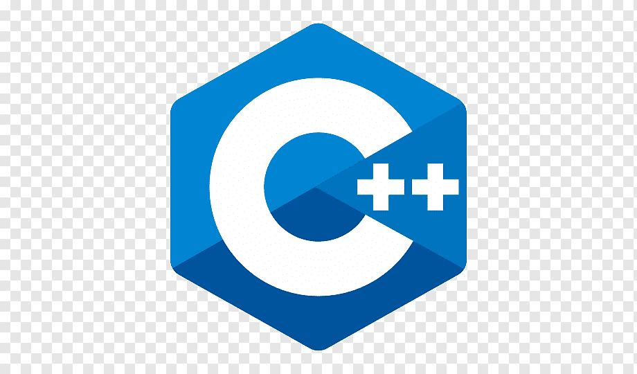
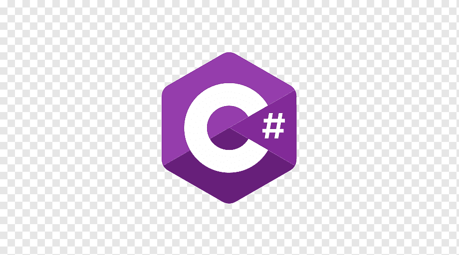
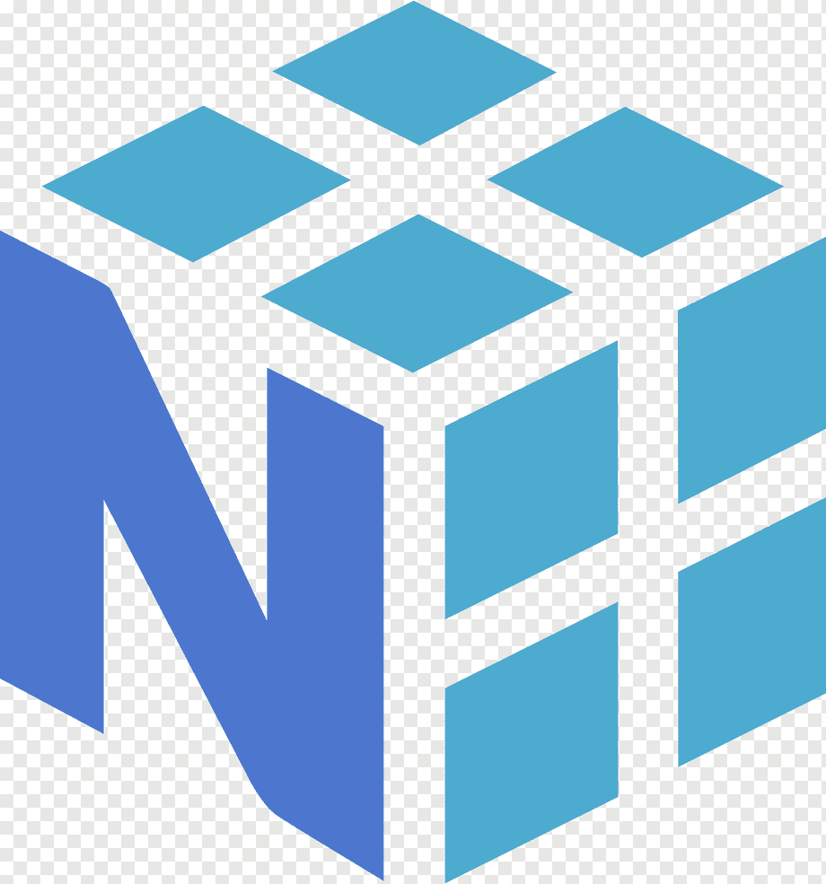
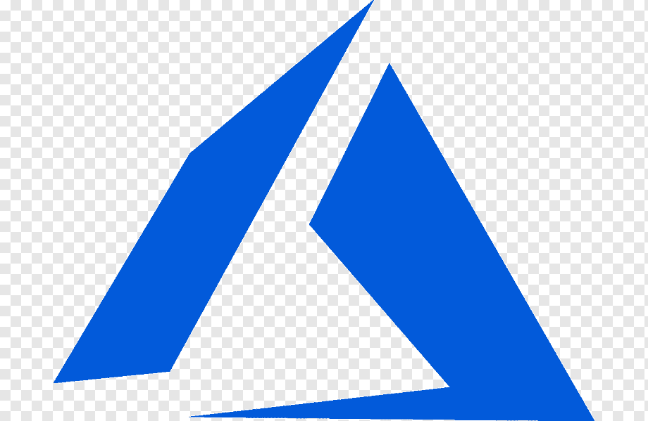
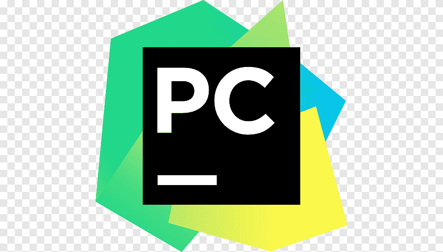
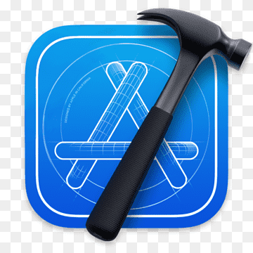

  
  

<h1 align="center">
  Hey, I'm Lucas Bracamonte
  
</h1>

  

---

### GitHub Trophies :

---

### ⚡ Languages:

  <table>
    <tr>
      <td align="center" width="88">
        
         Python
      </td>
      <td align="center" width="88">
        
         php
      </td>
      <td align="center" width="88">
        
         JavaScript
      </td>
      <td align="center" width="88">
        
         TypeScript
      </td>
      <td align="center" width="88">
        
         CSS3
      </td>
      <td align="center" width="88">
        
         React.js
      </td>
      <td align="center" width="88">
        
         Next.js
      </td>
      <td align="center" width="88">
        
         Node.js
      </td>
    </tr>
    <tr>
      <td align="center" width="88">
        
         .NET
      </td>
      <td align="center" width="88">
        
         Sass
      </td>
      <td align="center" width="88">
        
         Tailwind
      </td>
      <td align="center" width="88">
        
         Bootstrap
      </td>
      <td align="center" width="88">
        
         Html5
      </td>
      
    </tr>
  </table>

---

### 🤖 AI / ML:

  <table>
    <tr>
      <td align="center" width="88">
        
         Python
      </td>
      <td align="center" width="88">
        
         TensorFlow
      </td>
      <td align="center" width="88">
        
         Scikit-learn
      </td>
      <td align="center" width="88">
        
         Pandas
      </td>
      <td align="center" width="88">
        
         NumPy
      </td>
      <td align="center" width="88">
        
         OpenCV
      </td>
      <td align="center" width="88">
        
         Hugging Face
      </td>
      <td align="center" width="88">
        
         Ollama
      </td>
    </tr>
    <tr>
      <td align="center" width="88">
        
         OpenAI
      </td>
      <td align="center" width="88">
        
         Gemini
      </td>
      <td align="center" width="88">
        
         Cloude Code
      </td>
      <td align="center" width="88">
        
         Jupyter
      </td>
    </tr>
  </table>

---

### Database:

  <table>
    <tr>
      <td align="center" width="88">
        
         SQL
      </td>
      <td align="center" width="88">
        
         NoSQL
      </td>
      <td align="center" width="88">
        
         MS SQL
      </td>
      <td align="center" width="88">
        
         Postgres SQL
      </td>
      <td align="center" width="88">
        
         MySQL
      </td>
      <td align="center" width="88">
        
         MariaDB
      </td>
      <td align="center" width="88">
        
         SQL Lite
      </td>
      <td align="center" width="88">
        
         MongoDB
      </td>
    </tr>
    <tr>
      <td align="center" width="88">
        
         UnqLite
      </td>
      <td align="center" width="88">
        
         Amazon RDS
      </td>
      <td align="center" width="88">
        
         Duck DB
      </td>
      <td align="center" width="88">
        
         Supabase
      </td>
      <td align="center" width="88">
        
         Airtable
      </td>
    </tr>
  </table>

---

### Operating system:

  <table>
    <tr>
      <td align="center" width="88">
        
         Windows
      </td>
      <td align="center" width="88">
        
         Linux
      </td>
      <td align="center" width="88">
        
         Mac OS
      </td>
      <td align="center" width="88">
        
         TypeScript
      </td>
      <td align="center" width="88">
        
         Android
      </td>
      <td align="center" width="88">
        
         IOS
      </td>
    </tr>
  </table>

---

### Other Tools:

  <table>
    <tr>
      <td align="center" width="88">
        
         Docker
      </td>
      <td align="center" width="88">
        
         GIT
      </td>
      <td align="center" width="88">
        
         GitHub
      </td>
      <td align="center" width="88">
        
         GitLab
      </td>
      <td align="center" width="88">
        
         Bitbucket
      </td>
      <td align="center" width="88">
        
         Postman
      </td>
      <td align="center" width="88">
        
         Insomnia
      </td>
      <td align="center" width="88">
        
         Azure
      </td>
    </tr>
    <tr>
      <td align="center" width="88">
        
         AWS
      </td>
      <td align="center" width="88">
        
         Notion
      </td>
    </tr>
  </table>

---

### IDEs:

  <table>
    <tr>
      <td align="center" width="88">
        
         Visual Code
      </td>
      <td align="center" width="88">
        
         NoSQL
      </td>
      <td align="center" width="88">
        
         NetBeans
      </td>
      <td align="center" width="88">
        
         PyCharm
      </td>
      <td align="center" width="88">
        
         xcode
      </td>
      <td align="center" width="88">
        
         Sublime Text
      </td>
      <td align="center" width="88">
        
         Jupyter Notebook
      </td>
    </tr>
    <tr>
      <td align="center" width="88">
        
         Cursor AI
      </td>
      <td align="center" width="88">
        
         Windsurf
      </td>
      <td align="center" width="88">
        
         Cloude Code
      </td>
      <td align="center" width="88">
        
         Codex
      </td>
      <td align="center" width="88">
        
         OpenCode
      </td>
      <td align="center" width="88">
        
         Gemini
      </td>
    </tr>
  </table>

---

### GitHub Stats :

  ### 💻 GitHub Stats

  
 

---

📩 **Let's talk:** [ing.lucasbracamonte@gmail.com](mailto:ing.lucasbracamonte) | [LinkedIn](https://www.linkedin.com/in/lucas-braca/)

---

<!--
**lucbra21/lucbra21** is a ✨ _special_ ✨ repository because its `README.md` (this file) appears on your GitHub profile.

Here are some ideas to get you started:

- 🔭 I’m currently working on ...
- 🌱 I’m currently learning ...
- 👯 I’m looking to collaborate on ...
- 🤔 I’m looking for help with ...
- 💬 Ask me about ...
- 📫 How to reach me: ...
- 😄 Pronouns: ...
- ⚡ Fun fact: ...
-->
